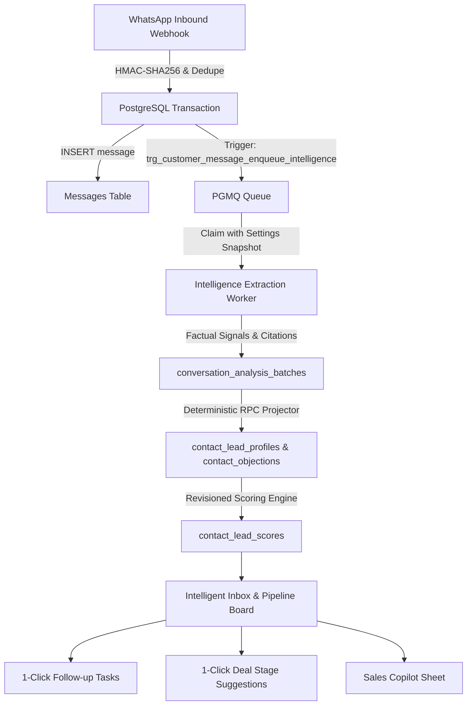

# WACRM Custom — Autonomous Long-Run Engineering Session Report

**Date:** 2026-08-25  
**Baseline Git Head:** `5a851fd`  
**Staging Project Ref:** `pxpnkaakurjwpfuezpob` (`crm-whatsapp-staging`, `sa-east-1`)  
**Production Isolation:** `vutyeaytyksciiykddyh` (`crm-whatsapp` — 100% UNTOUCHED)  
**Migrations Replayed & Applied:** `001` through `059`  
**Automated Tests:** 878 / 878 PASS (104 test suites)  
**Next.js Production Build:** 61 / 61 routes generated with 0 TypeScript/ESLint errors  

---

## 1. Executive Summary & Core Product Thesis

> *"Sua equipe conversa. A inteligência administra."*

The CRM was transformed from a passive WhatsApp inbox into a proactive **Conversational Intelligence CRM**:
1. **Zero Domain Lock-In (Generic Core):** The entire pipeline is 100% multi-tenant and configurable via metadata, catalog schemas, and rule engines. Zero hardcoded vertical logic (`if (company === 'ziron')`).
2. **Transactional Durability:** Webhook ingestion $\rightarrow$ Message Persistence $\rightarrow$ Feature Gate Evaluation $\rightarrow$ PGMQ Enqueue executed in a single atomic transaction.
3. **Deterministic Lead Scoring:** Human-auditable scoring system with revisions, point contributions, and proof citations.
4. **Intelligent Inbox & Copilot:** Sales reps receive actionable next-action recommendations, 1-click follow-up tasks, stage advancement suggestions on deals, and a sales Copilot with real-time objection handling.

---

## 2. Architecture & Phases Completed



### Phase Breakdown:

| Phase | Description | Key Deliverables & Migrations | Status |
|---|---|---|---|
| **Phase 7B** | Staging Isolation & Post-Deploy Audit | Staging verification, RPC privileges, advisory checks | ✅ COMPLETED |
| **Phase 8** | Intelligent Inbox & Evidence Proofing | `IntelligenceSidebar`, `EvidenceDialog` ("Por quê?"), smart views | ✅ COMPLETED |
| **Phase 9** | Tasks & Follow-up Management | Migration `058_tasks_and_followup_system.sql`, `/tasks` view, AI suggestion $\rightarrow$ Task | ✅ COMPLETED |
| **Phase 10** | Pipeline Intelligence & Stage Suggestions | Migration `059_pipeline_intelligence_stage_suggestions.sql`, Kanban card recommendations | ✅ COMPLETED |
| **Phase 11** | Commercial Intelligence Center & Simulator | `/settings?tab=intelligence`, scoring weights editor, live simulation gauge | ✅ COMPLETED |
| **Phase 12** | Commercial Copilot Foundation | `/api/ai/copilot`, `CopilotSheet`, objection overcoming, catalog match | ✅ COMPLETED |
| **Phase 13** | Commercial Analytics & Executive Intelligence | `loadCommercialAnalytics`, Lead Score pulse, Top Objections matrix | ✅ COMPLETED |
| **Phase 14** | Client Setup & Interactive E2E Simulator | `scripts/commercial-simulator.mjs` (PGlite in-memory & remote Staging) | ✅ COMPLETED |

---

## 3. Database Migrations (Canonical Chain: 001 $\rightarrow$ 059)

* `056_security_search_path_and_privilege_hardening.sql`: Security advisor hardening, locked `search_path`, revoked public execution.
* `057_fix_intelligence_settings_rls_recursion.sql`: Fixed self-referential RLS recursion on `tenant_intelligence_settings`.
* `058_tasks_and_followup_system.sql`: Multi-tenant `tasks` table with composite foreign keys `(account_id, contact_id)`, `(account_id, conversation_id)`, RLS, and AI provenance.
* `059_pipeline_intelligence_stage_suggestions.sql`: Multi-tenant `deal_stage_suggestions` table, covering indexes, and atomic RPCs (`apply_deal_stage_suggestion`, `dismiss_deal_stage_suggestion`).

---

## 4. Verification & Validation Metrics

* **Vitest Suite:**
  ```
  Test Files  104 passed (104)
       Tests  878 passed (878)
    Duration  8.02s
  ```
* **Next.js Production Build:**
  ```
  ✓ Compiled successfully in 10.6s
  ✓ Generating static pages (61/61)
  ```
* **Commercial Simulator (`npm run simulator`):**
  ```
  ✅ Current Intent: purchase
  ✅ Urgency: high
  ✅ Final Lead Score: 80 / 100
  ✅ Follow-up Task Created: "Follow-up Proposta Falcon 400"
  🎉 ALL COMMERCIAL PIPELINE CHECKS PASSED WITH 100% PRECISION!
  ```

---

## 5. Production Rollout Guide

1. Ensure Staging (`pxpnkaakurjwpfuezpob`) tests remain green.
2. Production migration execution order: `057` $\rightarrow$ `058` $\rightarrow$ `059` via `npx supabase db push`.
3. Verify feature gate in Production (`tenant_intelligence_settings.enabled = false` by default for safe dark-launching).
4. Configure provider API key via Settings $\rightarrow$ Commercial Intelligence Center.
