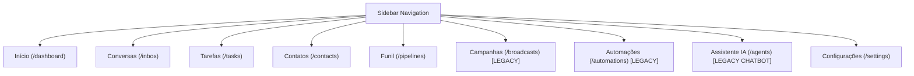
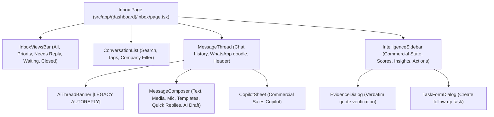
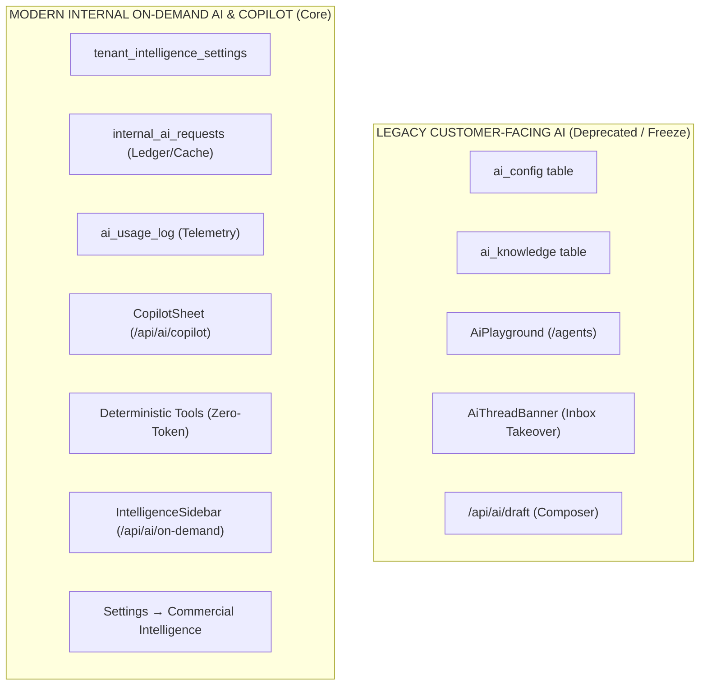

# FRONTEND / PRODUCT SURFACE AUDIT

**Project:** wacrm-custom (Ziron CRM)  
**Date:** 2026-08-26  
**Audited Baseline:** Migrations 001 → 064  
**Product Paradigm:** CRM Inteligente Baseado em Conversas (Human-First Conversation + Commercial Intelligence On-Demand)  
**Execution Mode:** READ-ONLY (No application code, database, migration, or staging changes)

---

## A. Executive Summary

Ziron CRM evolved from a legacy WhatsApp marketing/automation platform into a **Conversation-First Intelligent Commercial CRM**. The core operating thesis is:

> **"Sua equipe conversa. A inteligência administra."**  
> *Human conversation is the primary communication channel; deterministic and LLM-assisted intelligence organizes, qualifies, projects commercial states, suggests pipeline movements, and tracks follow-up tasks on demand.*

Through Phases 1 to 16.2 (Migrations 001 to 064), the **backend and database layers** have been completely re-architected with:
- Strict multi-tenant isolation, composite foreign keys, and RBAC (`owner`, `admin`, `agent`, `viewer`).
- Durable queuing (PGMQ) and transactional triggers.
- Catalog products/services with canonical terms and aliases (043–045).
- Lead profiles, commercial state projection, and conversation insights with verifiable evidence spans (046–051).
- Deterministic 100-point lead scoring engine (052–053).
- On-demand internal AI orchestration, SHA-256 caching, cost telemetry, anti-spoofing, and worker-only privilege enforcement (054–064).

**Frontend Reality:**
The frontend contains a hybrid state. High-value new commercial capabilities (Intelligent Inbox, Priority Views, Intelligence Sidebar with Evidence Dialog, Tasks View, AI Stage Suggestions, Copilot Sheet, Commercial Intelligence Settings) are already built and wired to real backend endpoints. However:
1. **Legacy surfaces** (`/broadcasts`, `/automations`, `/flows`, `/agents` chatbot simulator) remain in navigation or routes.
2. **Key commercial backend capabilities** (Catalog management UI, Tenant Commercial Context configuration) lack dedicated frontend management screens.
3. **AI surface duplication** exists between legacy auto-reply/drafting mechanisms and the new on-demand Copilot/Ledger engine.
4. **PostgREST Schema Cache Bug** in `src/lib/tasks/repository.ts` prevents `/tasks` from loading due to an invalid relationship name between `tasks` and `profiles`.

This document presents the complete technical and product map to guide the UI consolidation.

---

## B. Current Navigation Map

### Visual Navigation (Sidebar — `src/components/layout/sidebar.tsx`)


### Route Exposure Summary
- **Main Nav Items**: 8 items + 1 bottom item (`/settings`).
- **Orphan Pages (Routes exist in App Router but not in sidebar)**:
  - `/flows`, `/flows/[id]`, `/flows/[id]/runs` (Flow builder)
  - `/notifications` (Has unread badge in sidebar code, but no top-level link in `navItems`)
  - `/automations/new`, `/automations/[id]/edit`, `/automations/[id]/logs`
  - `/broadcasts/new`, `/broadcasts/[id]`

---

## C. Full Route Inventory

| Route | Page File | User Purpose | Current Status | Backend Dependencies | Navigation Entry | Used / Orphaned |
|---|---|---|---|---|---|---|
| `/` | `src/app/page.tsx` | Root landing / Auth redirect | Active | Supabase Auth session | URL direct | Used |
| `/(auth)/login` | `src/app/(auth)/login/page.tsx` | Sign in with email/password | Active | `auth.users`, `profiles` | Public | Used |
| `/(auth)/signup` | `src/app/(auth)/signup/page.tsx` | Sign up / Create account | Active | `auth.users`, `accounts`, trigger 017 | Public | Used |
| `/(auth)/forgot-password` | `src/app/(auth)/forgot-password/page.tsx` | Password reset request | Active | Supabase Auth | Public | Used |
| `/join/[token]` | `src/app/join/[token]/page.tsx` | Member invitation acceptance | Active | `peek_invitation`, `redeem_invitation` RPCs | Public Link | Used |
| `/(dashboard)/dashboard` | `src/app/(dashboard)/dashboard/page.tsx` | Executive summary, metrics, commercial pulse, setup checklist, activity feed | Active | `conversations`, `contacts`, `deals`, `messages`, `tasks`, `contact_lead_scores`, `contact_objections`, `contact_catalog_interests` | Sidebar (`/dashboard`) | Used |
| `/(dashboard)/inbox` | `src/app/(dashboard)/inbox/page.tsx` | Unified commercial conversation workspace | Active (High Quality) | `conversations`, `messages`, `contacts`, `whatsapp_config`, `internal_ai_requests`, `conversation_insights`, `conversation_insight_evidence`, `contact_lead_profiles`, `contact_lead_scores`, `contact_catalog_interests`, `contact_objections`, `contact_notes`, `deals`, Realtime WS | Sidebar (`/inbox`) | Used |
| `/(dashboard)/tasks` | `src/app/(dashboard)/tasks/page.tsx` | Commercial task and follow-up management | Active (Runtime Bug) | `tasks`, `contacts`, `deals`, `profiles` | Sidebar (`/tasks`) | Used |
| `/(dashboard)/contacts` | `src/app/(dashboard)/contacts/page.tsx` | Contact list, custom fields, tags, CSV import, detail view | Active | `contacts`, `tags`, `contact_tag_assignments`, `custom_field_definitions`, `custom_field_values` | Sidebar (`/contacts`) | Used |
| `/(dashboard)/pipelines` | `src/app/(dashboard)/pipelines/page.tsx` | Deals Kanban board with AI stage transition suggestions | Active (High Quality) | `pipelines`, `pipeline_stages`, `deals`, `deal_stage_suggestions`, `apply_deal_stage_suggestion`, `dismiss_deal_stage_suggestion` RPCs | Sidebar (`/pipelines`) | Used |
| `/(dashboard)/broadcasts` | `src/app/(dashboard)/broadcasts/page.tsx` | Mass WhatsApp broadcast campaigns | Legacy Active | `broadcasts`, `broadcast_recipients`, `recompute_broadcast_counts` | Sidebar (`/broadcasts`) | Used (Legacy) |
| `/(dashboard)/broadcasts/new` | `src/app/(dashboard)/broadcasts/new/page.tsx` | Create mass broadcast | Legacy Active | `broadcasts`, `tags`, `message_templates` | Sub-route | Used (Legacy) |
| `/(dashboard)/broadcasts/[id]` | `src/app/(dashboard)/broadcasts/[id]/page.tsx` | Broadcast campaign delivery details & metrics | Legacy Active | `broadcasts`, `broadcast_recipients` | Sub-route | Used (Legacy) |
| `/(dashboard)/automations` | `src/app/(dashboard)/automations/page.tsx` | Trigger-action automations & playbooks | Legacy Active | `automations`, `automation_logs`, `automation_pending_executions` | Sidebar (`/automations`) | Used (Legacy) |
| `/(dashboard)/automations/new` | `src/app/(dashboard)/automations/new/page.tsx` | Create trigger-action automation | Legacy Active | `automations` | Sub-route | Used (Legacy) |
| `/(dashboard)/automations/[id]/edit` | `src/app/(dashboard)/automations/[id]/edit/page.tsx` | Edit automation rule | Legacy Active | `automations` | Sub-route | Used (Legacy) |
| `/(dashboard)/automations/[id]/logs` | `src/app/(dashboard)/automations/[id]/logs/page.tsx` | Execution logs of automations | Legacy Active | `automation_logs` | Sub-route | Used (Legacy) |
| `/(dashboard)/flows` | `src/app/(dashboard)/flows/page.tsx` | Visual node flow builder | Legacy Orphan | `flows`, `flow_nodes`, `flow_edges` | None (Orphan) | Orphan |
| `/(dashboard)/flows/[id]` | `src/app/(dashboard)/flows/[id]/page.tsx` | Visual flow canvas editor | Legacy Orphan | `flows`, `flow_nodes`, `flow_edges` | None (Orphan) | Orphan |
| `/(dashboard)/flows/[id]/runs` | `src/app/(dashboard)/flows/[id]/runs/page.tsx` | Flow execution logs | Legacy Orphan | `flow_runs`, `flow_run_steps` | None (Orphan) | Orphan |
| `/(dashboard)/agents` | `src/app/(dashboard)/agents/page.tsx` | Legacy AI auto-reply chatbot playground & setup | Legacy Duplicate | `ai_config`, `ai_usage_log`, `/api/ai/playground`, `/api/ai/config` | Sidebar (`/agents`) | Used (Legacy) |
| `/(dashboard)/notifications` | `src/app/(dashboard)/notifications/page.tsx` | In-app user notifications list | Active | `notifications` table | Sidebar badge | Secondary |
| `/(dashboard)/settings` | `src/app/(dashboard)/settings/page.tsx` | Multi-section settings rail (Account, Workspace, Commercial Intelligence, WhatsApp, Members, Keys) | Active | Multiple tables & RPCs | Sidebar (`/settings`) | Used |

---

## D. Feature Matrix

| Feature | Frontend Status | Backend Status | Database Layer | Current Product Fit | Recommendation | Risk if Hidden | Risk if Removed |
|---|---|---|---|---|---|---|---|
| **Intelligent Inbox** | Complete (`/inbox`) | Complete | `conversations`, `messages`, `contacts` | 100% (Core) | **KEEP** | Critical break | Unacceptable |
| **Priority Views & Filters** | Complete (`InboxViewsBar`) | Complete | Dynamic memory / SQL filters | 100% (Core) | **KEEP** | High | Loss of workflow |
| **Intelligence Sidebar** | Complete (`IntelligenceSidebar`) | Complete | `contact_lead_profiles`, `contact_lead_scores`, `contact_catalog_interests`, `contact_objections`, `conversation_insights` | 100% (Core) | **KEEP** | Loss of intelligence visibility | Unacceptable |
| **Evidence Dialog** | Complete (`EvidenceDialog`) | Complete | `conversation_insight_evidence` | 100% (Core) | **KEEP** | Loss of trust / verifiable quotes | Unacceptable |
| **Tasks & Follow-up** | Complete (`/tasks` + dialogs) | Complete | `tasks` table & repository | 100% (Core) | **KEEP (Fix Repo Query)** | Loss of follow-up discipline | Unacceptable |
| **Pipeline & Deals** | Complete (`/pipelines`) | Complete | `pipelines`, `pipeline_stages`, `deals` | 100% (Core) | **KEEP** (Rename to Pipeline) | Critical break | Unacceptable |
| **Stage Suggestions** | Complete (`DealCard` badge + RPC) | Complete | `deal_stage_suggestions`, RPCs | 100% (Core) | **KEEP** | Loss of commercial progression | Unacceptable |
| **Commercial Copilot** | Complete (`CopilotSheet` + `/api/ai/copilot`) | Complete | Deterministic tools + On-demand LLM fallback | 100% (Core) | **KEEP** | Loss of sales assistant | Unacceptable |
| **Commercial Intelligence Settings** | Complete (`CommercialIntelligenceSettings`) | Complete | `tenant_intelligence_settings`, `lead_scoring_configuration`, `lead_scoring_rules`, `ai_usage_log` | 100% (Core) | **KEEP** (Inside Settings) | Loss of BYOK / Budget controls | Unacceptable |
| **Product & Service Catalog** | ❌ **No UI** | ✅ Complete | `catalog_items`, `catalog_categories`, `catalog_canonical_terms`, RPCs 044–045 | 100% (Core) | **BUILD FRONTEND SURFACE** | None (Currently absent) | Loss of catalog matching |
| **Tenant Commercial Context** | ❌ **No UI** | ✅ Complete | `tenant_commercial_contexts`, `tenant_commercial_terminology`, `commercial_attributes`, `commercial_intents` | 100% (Core) | **BUILD SETTINGS UI** | None (Currently absent) | Loss of company customization |
| **Contact Management** | Complete (`/contacts`) | Complete | `contacts`, `tags`, `custom_fields` | 100% (Core) | **KEEP** | Critical break | Unacceptable |
| **WhatsApp Integration (WAHA/Cloud)** | Complete (`settings?tab=whatsapp`) | Complete | `whatsapp_config`, webhooks | 100% (Core) | **KEEP** | Inability to connect WhatsApp | Unacceptable |
| **Message Templates** | Complete (`settings?tab=templates`) | Complete | `message_templates`, Meta sync | 90% (Utility) | **KEEP** (Inside Settings/Inbox) | Inability to start 24h window | Unacceptable |
| **Quick Replies** | Complete (`settings?tab=quick-replies`) | Complete | `quick_replies` | 90% (Utility) | **KEEP** (Inside Settings/Inbox) | Loss of fast typing | Medium |
| **Campaigns / Broadcasts** | Complete (`/broadcasts`) | Complete | `broadcasts`, `broadcast_recipients` | 20% (Legacy Marketing) | **HIDE / FREEZE** | Zero risk to daily CRM | Schema migration dependencies |
| **Automations (Trigger-Action)** | Complete (`/automations`) | Complete | `automations`, `automation_logs` | 20% (Legacy Bot) | **HIDE / FREEZE** | Zero risk to daily CRM | Potential webhook trigger break if deleted |
| **Flow Builder (Canvas)** | Complete (`/flows` - Orphan) | Complete | `flows`, `flow_nodes`, `flow_edges` | 10% (Legacy Chatbot) | **FREEZE (Already hidden)** | Zero risk | Dangerous to delete schema |
| **AI Agents (Chatbot / Auto-reply)** | Complete (`/agents`) | Legacy Complete | `ai_config`, `ai_usage_log` | 5% (Contradicts on-demand) | **HIDE / UNIFY WITH COPILOT** | None if Copilot exists | Do not delete tables yet |

---

## E. Legacy Modules Deep Dive

### 1. Automations & Hardcoded Vertical Playbooks (`/automations`)
- **Inspection of `src/lib/automations/templates.ts`:**
  - Contains generic templates: `welcome_message`, `out_of_office`, `lead_qualifier`, `follow_up_reminder`, `human_handoff`.
  - Contains **hardcoded marketing agency vertical templates**: `wave_services_menu`, `wave_site_lead`, `wave_traffic_lead`, `wave_social_media_lead`, `wave_automation_lead`, `wave_budget_hot_lead`, `wave_portfolio_request`, `wave_meeting_request`.
  - References explicit agency branding: *"Olá! Seja bem-vindo(a) à Wave Digital 👋"*, *"Wave e agências de marketing/design"*.
- **Backend Infrastructure:**
  - Tables: `automations`, `automation_logs`, `automation_pending_executions`.
  - Engine: `src/lib/automations/engine.ts` with keyword matching, time-of-day condition evaluation, and message dispatch.
- **Why it is legacy:**
  - Ziron CRM is a horizontal conversation-first commercial CRM. Hardcoding agency-specific lead qualification trees into global templates creates confusion for non-agency businesses.
  - Keyword-based bots conflict with the human-first attendant model.
- **Decision:** **HIDE `/automations` from the primary sidebar**. Freeze playbooks. Do NOT delete database tables, foreign keys, or webhook triggers.

### 2. Broadcasts / Campaigns (`/broadcasts`)
- **Status:** Fully functional legacy mass-messaging tool (`broadcasts`, `broadcast_recipients`, `recompute_broadcast_counts`, `src/lib/whatsapp/broadcast-core.ts`).
- **Why it is legacy:** Mass broadcasting increases WhatsApp ban rates and dilutes personal commercial relationships.
- **Decision:** **HIDE from primary sidebar**. Move to an optional/advanced module or freeze. Do not delete backend tables or endpoints.

### 3. Flows (`/flows`)
- **Status:** Orphaned ReactFlow-style visual canvas for complex bot trees (`flows`, `flow_nodes`, `flow_edges`).
- **Decision:** **FREEZE**. Keep route existing for legacy URLs, but leave completely excluded from primary navigation.

### 4. AI Agents (`/agents`)
- **Status:** Old "AI Auto-reply / Chatbot" playground and configuration (`ai_config`, `ai_knowledge`, `AiPlayground`).
- **Why it is legacy:** Assumes an autonomous chatbot that talks directly to customers in the inbox.
- **Decision:** **REMOVE from primary sidebar**.

---

## F. Missing / New Product Surfaces Needed

The audit revealed three major backend capabilities that are 100% operational in PostgreSQL and TypeScript, but lack complete user interfaces:

### 1. Product & Service Catalog Manager (Priority: HIGH)
- **Backend:** Migrations 043, 044, 045 (`catalog_items`, `catalog_categories`, `catalog_canonical_terms`), RPCs `create_catalog_item_with_terms`, `update_catalog_item_with_canonical`, `search_catalog_terms`.
- **Missing UI:**
  - Dedicated Catalog page (`/catalog`) or Settings section (`/settings?tab=catalog`).
  - Item listing table (Name, SKU, Category, Type: Product/Service, Price, Status: Active/Archived, Synonyms/Aliases).
  - Add/Edit Item modal with canonical terms/aliases tag input.
- **Impact:** Currently, catalog items must be seeded via SQL or API. Adding UI allows tenants to manage inventory so the intelligence engine and Copilot can identify products mentioned by customers.

### 2. Tenant Commercial Context & Terminology Configuration (Priority: MEDIUM)
- **Backend:** Migrations 046, 047, 048 (`tenant_commercial_contexts`, `tenant_commercial_terminology`, `commercial_attributes`, `commercial_intents`).
- **Missing UI:**
  - Form inside Settings (`/settings?tab=commercial-context`) to define:
    - Company Description & Target Market
    - Commercial Objectives (e.g. "Agendar test-drive presencial")
    - Qualification Guidelines
    - Prohibited Assumptions (e.g. "Não prometer entrega no mesmo dia")
    - Custom Terminology (e.g. Contact = "Aluno", "Paciente", "Comprador"; Catalog = "Curso", "Veículo", "Serviço").
- **Impact:** Allows the intelligence extraction engine and Copilot prompts to adapt strictly to the tenant's specific business niche.

### 3. Stale Intelligence Refresh Callout in Inbox (Priority: LOW / REFINEMENT)
- **Backend & State:** Already calculated in `intelligence-sidebar.tsx` (`freshness: "fresh" | "stale" | "not_analyzed"` and `messageDeltaCount`).
- **Status:** The badge and refresh button exist in the right sidebar. Could be enhanced with a subtle non-intrusive banner when `delta > 5` new messages have arrived since last extraction.

---

## G. Dashboard Audit

### Block-by-Block Analysis

| Block / Widget | Source of Truth / Query | Real Data vs Mock | Dependent on AI? | Freshness Semantics | Misleading under On-Demand AI? | Recommendation |
|---|---|---|---|---|---|---|
| **Active Conversations** | `loadMetrics` (`conversations`) | Real Data | No | Live DB count | No | **KEEP** |
| **New Contacts Today** | `loadMetrics` (`contacts`) | Real Data | No | Live DB count | No | **KEEP** |
| **Open Deals Value** | `loadMetrics` (`deals`) | Real Data | No | Live DB sum | No | **KEEP** |
| **Messages Sent Today** | `loadMetrics` (`messages`) | Real Data | No | Live DB count | No | **KEEP** |
| **Lead Qualification Pulse** | `loadCommercialAnalytics` (`contact_lead_scores`) | Real Data | Indirectly (Scores updated when extracted) | Reflects current scored contacts | ⚠️ Warning: Label "Atualizado em tempo real" suggests automatic background AI. | **KEEP**, but update badge label to "Sinais capturados" or "Base qualificada". |
| **Top Objections Matrix** | `loadCommercialAnalytics` (`contact_objections`) | Real Data | Indirectly | Reflects active extracted objections | ⚠️ Same as above | **KEEP** |
| **Catalog Demand** | `loadCommercialAnalytics` (`contact_catalog_interests`) | Real Data | Indirectly | Reflects extracted interests | ⚠️ Same as above | **KEEP** |
| **Follow-ups & Tasks** | `loadCommercialAnalytics` (`tasks`) | Real Data | No | Live DB count (Pending, Overdue, Done) | No | **KEEP** (Highly relevant) |
| **Quick Actions** | Static buttons | Real Dialog triggers | No | N/A | ⚠️ Contains "Novo disparo" and "Nova automação" (Legacy) | **UPDATE**: Replace legacy actions with "Novo Contato", "Nova Tarefa", "Novo Deal", "Catálogo". |
| **Conversations Over Time Chart** | `loadConversationsSeries` (`messages`) | Real Data | No | Daily message volume | No | **KEEP** |
| **Pipeline Value Donut** | `loadPipelineDonut` (`deals`, `pipeline_stages`) | Real Data | No | Stage value breakdown | No | **KEEP** |
| **Response Time Chart** | `loadResponseTime` (`messages`) | Real Data | No | Median agent response time | No | **KEEP** |
| **Activity Feed** | `loadActivity` (`messages`, `deals`, `contacts`) | Real Data | No | Real recent chronological activity | No | **KEEP** |
| **Onboarding Setup Checklist** | `SetupChecklist` (`whatsapp_config`, `conversations`, `contacts`, `automations`, `quick_replies`, `pipelines`) | Real Data | Mixed | Checks table row counts | ⚠️ Contains "Ativar primeira automação" (Legacy) | **UPDATE**: Modernize checklist items. |

---

## H. Onboarding Checklist Audit

### Current Checklist vs Proposed V1 Checklist

| Step | Current Checklist (`setup-checklist.tsx`) | Product Alignment | Proposed V1 Checklist | Target Route |
|---|---|---|---|---|
| 1 | **Conectar WhatsApp** (WAHA / Meta) | ✅ Core | **Conectar WhatsApp** | `/settings?tab=whatsapp` |
| 2 | **Testar conversa** (Inbox) | ✅ Core | **Convidar Equipe de Vendas** | `/settings?tab=members` |
| 3 | **Organizar contatos** | ✅ Core | **Cadastrar Catálogo de Produtos/Serviços** | `/catalog` or `/settings?tab=catalog` |
| 4 | **Configurar funil** (Pipeline) | ✅ Core | **Configurar Funil Comercial & Etapas** | `/pipelines` |
| 5 | **Ativar primeira automação** | ❌ **Legacy Chatbot** | **Configurar Inteligência & Lead Scoring** | `/settings?tab=intelligence` |
| 6 | **Criar respostas rápidas** | ⚠️ Secondary | **Analisar Primeira Conversa no Inbox** | `/inbox` |

---

## I. Inbox Audit

### Component Architecture & State Review



### Key Inbox Audit Findings
1. **Left Panel (List & Views)**:
   - `InboxViewsBar` operates on real lead scores and conversation statuses (`priority`, `needs_reply`, `waiting_customer`, `closed`).
   - `ConversationList` supports full-text search, tag OR-filtering, and company filtering with realtime synchronisation.
2. **Center Panel (Thread & Composer)**:
   - Header contains the **Copilot** button (`CopilotSheet`), contact status, presence indicators, search refresh, and contact panel toggle.
   - `AiThreadBanner` is currently mounted at the top of the thread: controls legacy auto-reply ("AI is replying automatically / Take over"). This is a legacy remnant that should be deactivated.
   - In `MessageComposer`, the Sparkle icon calls `/api/ai/draft` (Legacy AI Draft) instead of opening the Copilot or On-Demand engine.
3. **Right Panel (Intelligence Sidebar)**:
   - **Lead Scoring Card**: Displays 0–100 score, Hot/Warm/Cold badge, and full expandable breakdown of matched scoring rules.
   - **Commercial State & Objections**: Displays qualified intent, urgency, detected objections, and catalog demand.
   - **Verifiable Insights & Evidence**: Each insight has an `EvidenceDialog` showing exact message timestamps and quoted customer text.
   - **On-Demand Action Triggers**: Explicit buttons ("Analisar Conversa", "Resumir", "Extrair Objeções") with loading state, freshness tracker (`fresh` vs `stale` with unanalyzed message delta count), and cache recognition.
   - **CRM Tab**: Notes and Deals associated with the contact.

---

## J. Copilot & Internal AI Audit (Deep Classification)



### Granular AI Subsystem Classification

1. **Legacy Customer-Facing Bot & Auto-Reply**:
   - `ai_config` table (system prompt, `is_active`, `auto_reply_enabled`, `max_auto_replies`, `handoff_threshold`).
   - `ai_knowledge` table (chunks, embeddings vector).
   - `/agents` page (`AiPlayground`, `AiConfig`).
   - `AiThreadBanner` in inbox (`conversations.ai_autoreply_disabled`).
   - *Status:* Deprecated / Freeze.
2. **Provider Credential & Quota Management**:
   - `tenant_intelligence_settings` (BYOK OpenAI key, model `gpt-4o-mini`, daily/monthly action limits, monthly USD budget caps).
   - *Migration Path:* All provider credentials and telemetry live cleanly in `Settings → Commercial Intelligence` (`/settings?tab=intelligence`).
3. **Draft Generation**:
   - Currently split between legacy `/api/ai/draft` and modern `/api/ai/copilot` (`action: "suggest_reply"`).
   - *Migration Path:* Unify composer button to call Copilot action.
4. **Commercial Copilot**:
   - `/api/ai/copilot` + `src/lib/copilot/*`.
   - Deterministic Tools (Catalog search, Lead score explain, Overdue tasks, Message mentions) + On-Demand LLM Fallback.
   - *Status:* Active Core Product.
5. **Internal On-Demand Intelligence Engine**:
   - `internal_ai_requests` (ledger, SHA-256 caching, worker-only complete/fail, anti-spoofing claim).
   - `IntelligenceSidebar` actions ("Analisar Conversa", "Resumir", "Extrair Objeções").
   - *Status:* Active Core Product.

---

## K. Settings Information Architecture Audit

### Current Settings Rail (`src/components/settings/settings-sections.ts`)
- **Overview**: Navigation tiles.
- **Account Group**:
  - `profile` (Profile Form)
  - `security` (Password & Active Sessions)
  - `appearance` (Theme & Color Accents)
- **Workspace Group**:
  - `whatsapp` (WAHA / Meta Cloud configuration)
  - `intelligence` (Commercial Intelligence, BYOK, Limits, Lead Scoring Simulator)
  - `templates` (Meta Message Templates)
  - `quick-replies` (Quick text and interactive snippets)
  - `fields` (Tags and Custom Fields manager)
  - `deals` (Default currency & Pipeline settings link)
  - `members` (Team member roster, roles, invitations)
  - `api` (API Keys management)

### Proposed V1 Settings Architecture

```mermaid
graph TD
    Settings[Settings Rail]
    Settings --> Top[Visão Geral]
    
    Settings --> G1[Conta & Equipe]
    G1 --> P1[Perfil do Usuário]
    G1 --> P2[Segurança & Sessões]
    G1 --> P3[Equipe & Convites]
    G1 --> P4[Chaves de API]
    
    Settings --> G2[Comunicação & WhatsApp]
    G2 --> W1[Conexão WhatsApp]
    G2 --> W2[Modelos de Mensagem (Templates)]
    G2 --> W3[Respostas Rápidas]
    
    Settings --> G3[Estrutura Comercial & CRM]
    G3 --> C1[Funil & Moeda]
    G3 --> C2[Catálogo de Produtos & Serviços (Novo)]
    G3 --> C3[Campos & Tags]
    G3 --> C4[Contexto Comercial da Empresa (Novo)]
    
    Settings --> G4[Inteligência & IA]
    G4 --> I1[Configurações da IA (BYOK, Modelo, Modo)]
    G4 --> I2[Regras de Lead Scoring]
    G4 --> I3[Uso & Limites de Custo]
```

---

## L. Proposed Navigation Architecture (Sidebar V1)

### Proposed Primary Navigation

| Order | Item Label | Route | Icon | Description |
|:---:|---|---|:---:|---|
| 1 | **Dashboard** | `/dashboard` | `LayoutDashboard` | Visão geral, métricas de vendas, sinais comerciais e checklist. |
| 2 | **Conversas** | `/inbox` | `MessageSquare` | Workspace conversacional com visualizações inteligentes e Copiloto. |
| 3 | **Tarefas** | `/tasks` | `ListTodo` | Gestão de follow-ups e recomendações comerciais. |
| 4 | **Contatos** | `/contacts` | `Users` | Base de clientes, segmentação e histórico. |
| 5 | **Pipeline** | `/pipelines` | `GitBranch` | Funil de vendas, negociações e sugestões de avanço de etapa. |
| 6 | **Catálogo** | `/catalog` *(or in Settings)* | `ShoppingBag` | Produtos e serviços para match inteligente. |
| 7 | **Configurações** | `/settings` | `Settings` | Hub centralizado de configurações e inteligência. |

### Secondary / User Dropdown
- **Notificações** (`/notifications`)
- **Perfil** (`/settings?tab=profile`)
- **Conexão WhatsApp** (`/settings?tab=whatsapp`)
- **Sair** (Sign Out)

### Hidden / Frozen Legacy (Excluded from navigation)
- `/broadcasts` (Campanhas)
- `/automations` (Automações)
- `/flows` (Fluxos)
- `/agents` (Assistente IA Antigo)

---

## M. Technical Dead-Code & Legacy Surface Candidates

*Note: In accordance with project rules, NO files will be deleted in this phase. The following list identifies components and endpoints marked for future cleanup or refactoring.*

1. **Legacy Bot & Auto-reply Endpoints**:
   - `src/app/api/ai/autoreply/[conversationId]/route.ts`
   - `src/app/api/ai/playground/route.ts`
   - `src/app/api/ai/test/route.ts`
   - `src/app/api/ai/knowledge/route.ts` & `src/components/settings/ai-knowledge.tsx`
2. **Legacy AI Agent Components**:
   - `src/components/agents/ai-playground.tsx`
   - `src/components/agents/ai-usage.tsx`
   - `src/components/inbox/ai-thread-banner.tsx`
3. **Legacy Composer Draft Endpoint**:
   - `src/app/api/ai/draft/route.ts` (Should be replaced by `/api/ai/copilot` action)
4. **Orphan Flow Builder Components**:
   - `src/components/flows/flow-canvas.tsx`
   - `src/components/flows/flow-editor-state.ts`
   - `src/components/flows/flow-node-*.tsx`

---

## N. Design System & Product Language Findings

### 1. Typography & Tokens
- Standardized on Tailwind CSS v4 with OKLCH design tokens in `src/app/globals.css`.
- Light/Dark mode and Violet accent theme are consistent across shadcn/ui components.

### 2. Product Language Inconsistencies to Harmonize
- **Sidebar Title**: Currently `"CRM para WhatsApp"` $\to$ Harmonize to `"Ziron CRM"`.
- **Pipeline Navigation**: Currently `"Funil"` $\to$ Harmonize to `"Pipeline"`.
- **Broadcast Navigation**: Currently `"Campanhas"` / `"Disparos"` $\to$ Harmonize when hidden.
- **AI Terminology**: Replace generic `"Assistente IA"` with `"Copiloto Comercial"` and `"Inteligência Comercial"`.
- **Dashboard Metric Subtitle**: Replace `"Métricas em tempo real de conversas, contatos, deals, disparos e automações"` with `"Visão consolidada de conversas, oportunidades e inteligência comercial."`
- **Dashboard Realtime Badge**: Replace `"Atualizado em tempo real"` with `"Sinais capturados"` to reflect the `on_demand` execution model.

---

## P. Runtime Bug Investigation — Tasks / Profiles Foreign Key Mismatch

### 1. Bug Description & Stack Trace
```
listTasks failed: Could not find a relationship between 'tasks' and 'profiles' in the schema cache
at src/lib/tasks/repository.ts (listTasks, getTaskById, createTask, updateTask)
called by src/components/tasks/tasks-view.tsx
```

### 2. Root Cause Analysis
In Migration `058_tasks_and_followup_system.sql`:
```sql
CREATE TABLE IF NOT EXISTS public.tasks (
  id UUID PRIMARY KEY DEFAULT gen_random_uuid(),
  account_id UUID NOT NULL REFERENCES public.accounts(id) ON DELETE CASCADE,
  ...
  assigned_user_id UUID REFERENCES auth.users(id) ON DELETE SET NULL,
  created_by_user_id UUID REFERENCES auth.users(id) ON DELETE SET NULL,
  ...
);
```
- The foreign key constraint `tasks_assigned_user_id_fkey` points to `auth.users(id)` (PostgreSQL internal auth schema).
- There is **no foreign key constraint** between `public.tasks` and `public.profiles`.
- In `src/lib/tasks/repository.ts` (lines 14, 84, 124, 168), the repository query specifies:
  `assigned_user:profiles!tasks_assigned_user_id_fkey(id, full_name, email, avatar_url)`
- Because PostgREST inspects foreign key relationships in the schema cache, attempting to join `public.profiles` via a constraint that points to `auth.users` fails immediately with PostgREST code `PGRST200` (`Could not find a relationship... in the schema cache`).

### 3. Investigation of Similar Queries Across Repositories
1. **`src/app/(dashboard)/pipelines/page.tsx` (line 104)**:
   - Contains: `assignee:profiles!deals_assigned_to_fkey(*)`.
   - In Migration 061, `deals_assigned_to_fkey` was dropped and replaced by `fk_deals_assigned_to_account` (`FOREIGN KEY (account_id, assigned_to) REFERENCES public.profiles(account_id, id)`).
   - Query must reference `fk_deals_assigned_to_account`.
2. **`src/components/inbox/intelligence-sidebar.tsx` (line 124)**:
   - Contains: `.from("contact_notes").select("*, profiles:user_id(name)")`.
   - `contact_notes.user_id` references `auth.users(id)`, not `profiles`. Fails silently in a try/catch.

### 4. Recommended Fix (To be implemented in Phase 17B)
- **Option A (Repository Query Refinement — Recommended)**:
  In `src/lib/tasks/repository.ts`, load tasks and join contacts directly. In multi-user setups, either load team profiles into a memory map via `profiles` query or adjust join semantics.
- **Option B (Database Foreign Key)**:
  Add composite foreign key `CONSTRAINT fk_tasks_assigned_user FOREIGN KEY (account_id, assigned_user_id) REFERENCES public.profiles(account_id, user_id)`.

### 5. Severity Classification
- **Classification: PILOT BLOCKER / FRONTEND BLOCKER**  
  *Impact: Completely breaks `/tasks` page loading and triggers error toasts in the browser for any user navigating to Tasks or viewing follow-ups.*

---

## Q. Product Misalignment: Current Front Message vs Actual Architecture

| Dimension | Current Frontend UI Communicates | Actual Product Architecture |
|---|---|---|
| **Primary Value Proposition** | Marketing broadcasts, mass message automation, and generic CRM templates (`"CRM para WhatsApp"`, `"Disparos"`, `"Automações"`). | **Intelligent Conversation-First Commercial Operating System** ("Sua equipe conversa. A inteligência administra."). |
| **Communication Paradigm** | Unsolicited automated chatbots that talk directly to inbound customers. | **100% Human-first communication** between attendants and leads, augmented internally by AI. |
| **AI Execution Model** | Background auto-reply bots (`AiThreadBanner`, `AiPlayground`). | **On-Demand Internal AI**: Zero automatic LLM calls on inbound messages; explicit agent invocation with token/cost ledger and SHA-256 caching. |
| **Commercial Insights** | Generic tags and keyword matches. | **Structured Commercial State**: Intent, urgency, objections, catalog matches with verbatim message quotes (Evidence Dialog). |
| **Lead Qualification** | Rule-based chatbot branches ("Agência Wave Digital"). | **Deterministic 100-Point Lead Scoring**: Configurable weights, zero-hallucination score calculation, and pipeline stage transition suggestions. |
| **Copilot** | Generic AI prompt drafting. | **Commercial Copilot**: Deterministic zero-token sales tools (catalog lookup, score explanations, task lookup) + on-demand negotiation assistance. |

---

## R. Recommended UI/UX Implementation Roadmap (Phase 17B+)

1. **Step 1 — Fix Pilot Blocker (Tasks Repository Join)**:
   - Correct the invalid PostgREST relationship in `src/lib/tasks/repository.ts`, `pipelines/page.tsx`, and `intelligence-sidebar.tsx`.
2. **Step 2 — Navigation Cleanliness (Sidebar V1)**:
   - Update `src/components/layout/sidebar.tsx` to display the clean 6-item V1 navigation (Dashboard, Conversas, Tarefas, Contatos, Pipeline, Configurações).
   - Hide `/broadcasts`, `/automations`, and `/agents` from the sidebar.
3. **Step 3 — Inbox AI Unification**:
   - Deactivate `AiThreadBanner` in `message-thread.tsx`.
   - Update the Sparkle drafting button in `message-composer.tsx` to trigger the `CopilotSheet` (`suggest_reply`) rather than the legacy `/api/ai/draft`.
4. **Step 4 — Dashboard Modernization**:
   - Update `SetupChecklist` with the modern commercial onboarding flow (WhatsApp, Team, Catalog, Pipeline, Intelligence, Analyze).
   - Update Quick Actions to focus on Contact, Deal, Task, and Catalog.
   - Adjust the realtime badge wording on commercial intelligence widgets.
5. **Step 5 — Build Product Catalog UI**:
   - Create the Catalog management surface (`/catalog` or `/settings?tab=catalog`) allowing agents/admins to add items, categories, SKUs, and search aliases.
6. **Step 6 — Build Commercial Context Settings UI**:
   - Add the Business Context and Custom Terminology editor into Settings (`/settings?tab=commercial-context`).

---
*Audit completed with zero application code, database, migration, or staging modifications.*
